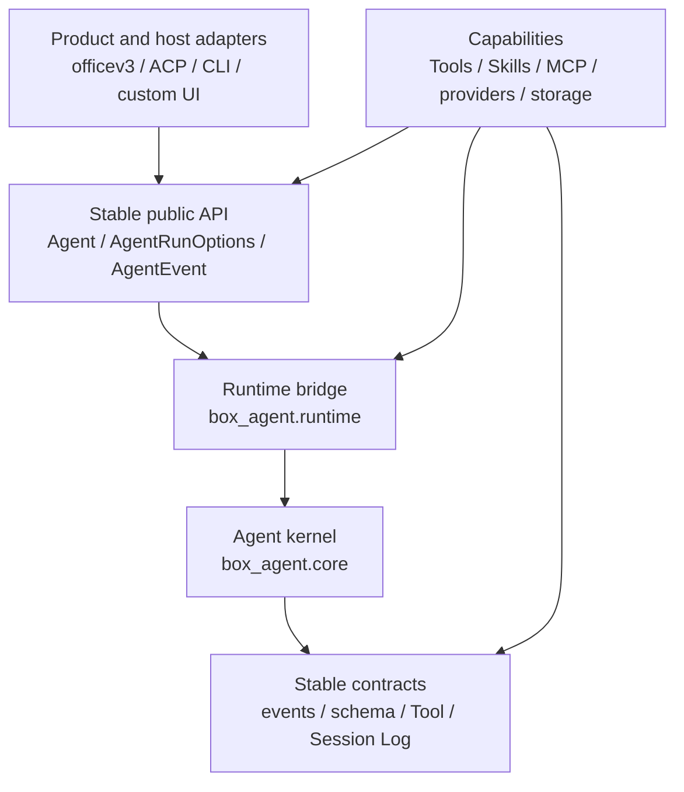

# Box-Agent Layered Architecture

## Decision

Box-Agent uses three collaboration layers. The core is a low-churn,
host-neutral agent kernel. Product behavior and format-specific execution policy
normally belong outside `box_agent/core.py`.



Dependencies point downward. The kernel must not import ACP, CLI, officev3, or
another product adapter. Application and capability modules must not import
`box_agent.core` directly.

## Layers and ownership

| Layer | Main code | Responsibility |
| --- | --- | --- |
| Product / integration | `box_agent/acp/`, `box_agent/cli.py`, host code | Protocol translation, host metadata, rendering, and host-selected Skills |
| Capability | `box_agent/tools/` except `base.py`, `box_agent/skills/`, provider implementations in `box_agent/llm/`, `memory.py` | Tools, self-contained Skills, providers, storage, and domain validators |
| Stable API / kernel | `agent.py`, `runtime.py`, `core.py`, `events.py`, `schema.py`, `session_log.py`, `loop_guards.py`, `hooks.py`, `artifacts.py`, `tools/base.py` | Loop invariants, scheduling, cancellation, generic budgets, persistence, and security seams |

“Core-owned” means a core maintainer reviews and approves the change. It does
not mean these files can never change.

## Public entry points

Application adapters run a turn through `Agent.run_events()` and provide a
complete `AgentRunOptions` snapshot:

```python
from dataclasses import replace

options = replace(
    agent.default_run_options(),
    session_id=host_session_id,
    permission_negotiator=permission_adapter,
    hooks=host_hooks,
)

async for event in agent.run_events(options=options):
    await render_for_host(event)
```

Framework capabilities that intentionally create an isolated low-level loop,
such as `SubAgentTool`, may import `run_agent_loop` from
`box_agent.runtime`. Production code outside that bridge must not import
`box_agent.core`.

## Session persistence and recovery

`SessionLog` is the only source of truth for durable Agent session state. It
records and replays generic facts: messages, tool calls and results, goals,
plans, todos, active Skills, compaction records, and turn boundaries.

The CLI selects a logical Session with `--session-id`/`--resume`; without an
explicit ID, each process starts a fresh CLI Session. ACP uses the host-provided
`_meta.session_id` as its logical ID, while its own `sessionId` is only a
process-local handle. Both adapters use the same SessionLog open/create path and
construct current system prompts, permissions, MCP connections, and sandbox
runtime from current configuration.

A Session owns one normalized cwd for its entire lifetime. Opening the same
Session with another workspace fails before the log is repaired or mutated.
Syntactically equivalent paths are accepted; a symlink alias is a distinct
workspace identity.

Legacy workflow-paused logs are downgraded during replay. Generic conversation
state and durable artifacts remain available, while old synthetic workflow
state is filtered and no domain state machine is reconstructed. Historical
checkpoint and owner files are not read, rewritten, or automatically deleted.

## Waiting for user input

Trusted interactive tools opt into `Tool.ends_turn_on_success`. A successful
request produces the generic `StopReason.WAITING_FOR_USER`; the kernel does
not continue with sibling tools or another model call. ACP maps this internal
reason to protocol `end_turn` and reports generic `runStatus:
waiting_for_user` metadata.

## Skills and domain policy

Skill activation is driven by an explicit invocation, current matcher results,
host-selected Skill names, or generic capability metadata. Host selection is
authoritative for the turn, so semantic matching does not append a competing
domain Skill.

Format-specific authoring stages, validators, scaffolders, finalizers, quality
rules, and recovery instructions belong in the corresponding Skill or plugin.
They derive progress from Session Log context and durable artifacts. The
kernel, CLI, and ACP do not infer delivery completeness, rebuild domain stages,
or force hidden continuation calls. `ArtifactEvent` reports artifact facts; it
does not certify that a task is complete.

## Where a change belongs

| Requirement | Put it here |
| --- | --- |
| Add a tool or external ability | A `Tool` implementation, Skill, or MCP server |
| Add a format-specific workflow or validator | The corresponding Skill or plugin |
| Add a model provider or wire quirk | `box_agent/llm/` |
| Change ACP fields, session metadata, or host rendering | `box_agent/acp/` |
| Change terminal commands or display | `box_agent/cli.py` |
| Change durable generic session facts | `session_log.py` and its replay tests |
| Add a host-neutral event or run option | Stable API/kernel, with core-team review |
| Change scheduling, cancellation, tool-call closure, or security invariants | Kernel, with core-team review |

If a product feature appears to require a Core edit, first ask whether it can
be expressed as a Tool, Skill, Hook, event consumer, or run option. If none is
sufficient, add the smallest generic contract; never embed a product name,
artifact format, or one domain state machine in the kernel.

## Automated boundary

`tests/test_architecture_boundaries.py` enforces the runtime bridge, prevents
Core dependencies on application adapters or removed workflow modules, and
checks that presentation state does not re-enter the stable kernel. Focused
behavior tests cover Session Log recovery, immutable cwd, generic waiting,
direct budgets, Skill preload, ACP translation, and legacy-file non-mutation.
