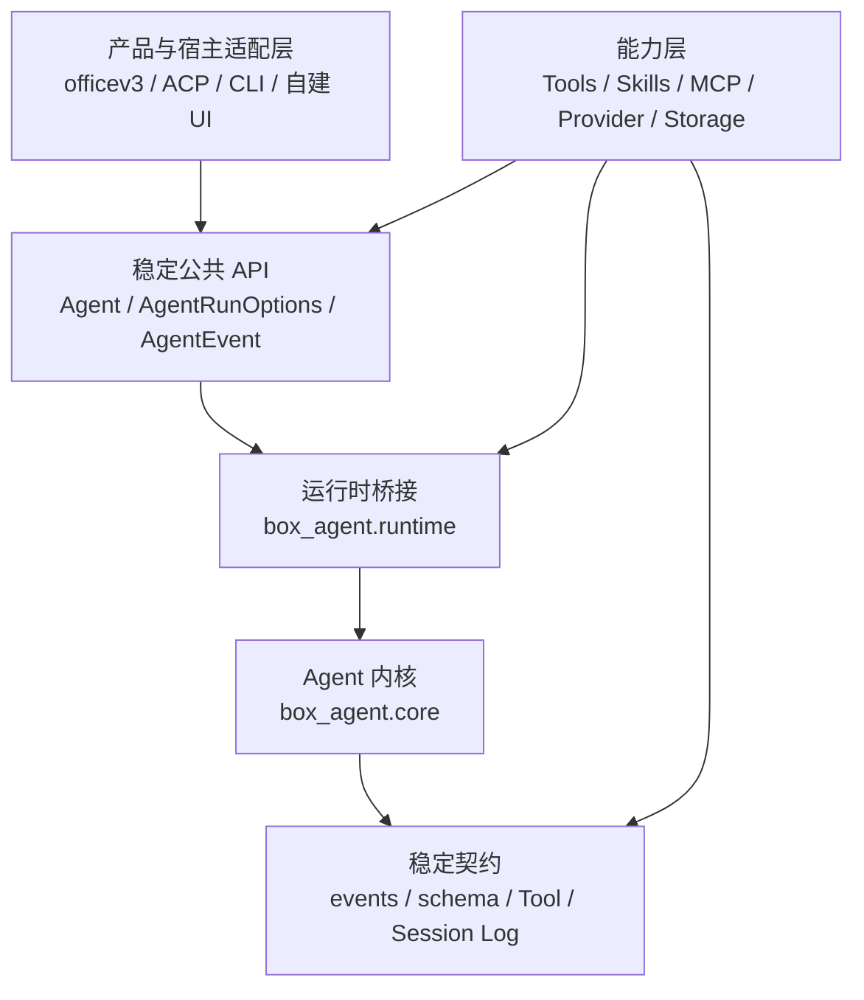

# Box-Agent 分层架构

## 架构决定

Box-Agent 采用三层协作结构。Core 是低频变化、与宿主及任务领域无关的 Agent
内核。产品行为和格式专用执行策略通常不应进入 `box_agent/core.py`。



依赖只能向下。内核不能依赖 ACP、CLI、officev3 或其他产品适配器；产品层与
能力层也不能直接导入 `box_agent.core`。

## 层级与职责

| 层级 | 主要代码 | 职责 |
| --- | --- | --- |
| 产品 / 接入层 | `box_agent/acp/`、`box_agent/cli.py`、宿主代码 | 协议转换、宿主元数据、渲染与宿主明确选择 Skill |
| 能力层 | `box_agent/tools/`（除 `base.py`）、`box_agent/skills/`、`box_agent/llm/` 中的 Provider、`memory.py` | Tool、自包含 Skill、Provider、存储与领域校验器 |
| 稳定 API / 内核层 | `agent.py`、`runtime.py`、`core.py`、`events.py`、`schema.py`、`session_log.py`、`loop_guards.py`、`hooks.py`、`artifacts.py`、`tools/base.py` | 循环不变量、调度、取消、通用预算、持久化与安全 seam |

“核心团队维护”表示修改需要核心维护者评审，不表示这些文件永远不能变化。

## 公共接入方式

产品适配器通过 `Agent.run_events()` 执行一轮，并提供完整的
`AgentRunOptions` 快照：

```python
from dataclasses import replace

options = replace(
    agent.default_run_options(),
    session_id=host_session_id,
    permission_negotiator=permission_adapter,
    hooks=host_hooks,
)

async for event in agent.run_events(options=options):
    await render_for_host(event)
```

确实需要独立低层循环的框架能力（例如 `SubAgentTool`）可以从
`box_agent.runtime` 导入 `run_agent_loop`。其他生产代码不得直接导入
`box_agent.core`。

## Session 持久化与恢复

`SessionLog` 是 Agent 会话持久化状态的唯一事实源。它记录并恢复消息、工具
调用与结果、Goal、Plan、Todo、活动 Skill、压缩记录和轮次边界等通用事实。

CLI 使用 `--session-id`/`--resume` 选择稳定的逻辑 Session ID；未提供时每次进程
启动创建新的 CLI Session。ACP 继续使用宿主 `_meta.session_id` 作为逻辑 ID，ACP
自身的 `sessionId` 只是进程内运行句柄。两种 Adapter 都通过同一个
`SessionLog.open_or_create()` 和 `Agent(session_log=...)` 恢复；system prompt、权限、
MCP 连接和 sandbox 等运行时对象仍按当前配置重新构建。

一个 Session 在整个生命周期内只拥有一个规范化 cwd。用不同 workspace 打开
同一 Session 时，会在修复或修改日志之前失败。语法等价路径可以接受；
symlink alias 被视为不同的 workspace identity。

旧 workflow-paused 日志只做降级恢复：保留通用对话状态和已有持久产物，过滤
旧 synthetic workflow state，不重建领域状态机。历史 checkpoint/owner 文件
不会被读取、改写或自动删除。

## 等待用户输入

受信任的交互 Tool 通过 `Tool.ends_turn_on_success` 明确声明成功后结束本轮。
成功请求产生通用 `StopReason.WAITING_FOR_USER`；内核不会继续执行同批兄弟
Tool，也不会额外调用模型。ACP 对外映射为协议 `end_turn`，并报告通用
`runStatus: waiting_for_user` 元数据。

## Skill 与领域策略

Skill 激活只由显式调用、当前 matcher、宿主明确选择或通用 capability metadata
驱动。宿主选择在本轮具有权威性，语义匹配不会再追加一个竞争的领域 Skill。

格式专用的创作阶段、validator、scaffold、finalizer、质量规则和恢复说明属于
对应 Skill 或插件，由 Session Log 上下文和持久文件事实推导进度。Core、CLI
和 ACP 不判断交付是否完成，不重建领域阶段，也不强制隐藏续跑。
`ArtifactEvent` 只报告产物事实，不认证任务完成。

## 一个需求应该放在哪里

| 需求 | 放置位置 |
| --- | --- |
| 新增工具或外部能力 | `Tool` 实现、Skill 或 MCP Server |
| 新增格式专用流程或校验器 | 对应 Skill 或插件 |
| 新增模型 Provider 或协议兼容 | `box_agent/llm/` |
| 修改 ACP 字段、会话元数据或宿主渲染 | `box_agent/acp/` |
| 修改终端命令或显示 | `box_agent/cli.py` |
| 修改通用会话持久化事实 | `session_log.py` 及其 replay 测试 |
| 新增宿主无关事件或 Run Option | 稳定 API / 内核，需要核心团队评审 |
| 修改调度、取消、Tool 闭合或安全不变量 | 内核，需要核心团队评审 |

如果产品功能看起来必须修改 Core，先判断能否通过 Tool、Skill、Hook、事件消费
者或 Run Option 表达。都不满足时，才增加最小、通用契约；不要把产品名、
产物格式或某个领域状态机写入内核。

## 自动边界

`tests/test_architecture_boundaries.py` 保护 runtime bridge，禁止 Core 依赖产品
适配器或已删除的 workflow 模块，并防止演示文稿状态重新进入稳定内核。聚焦
行为测试覆盖 Session Log 恢复、cwd 不可变化、通用等待、直接预算、Skill
预加载、ACP 翻译和旧文件不变。
